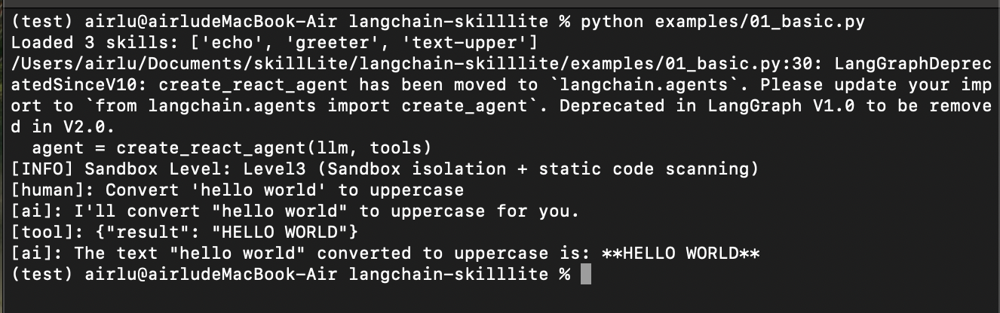
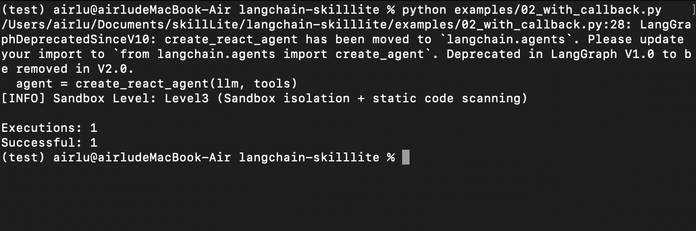
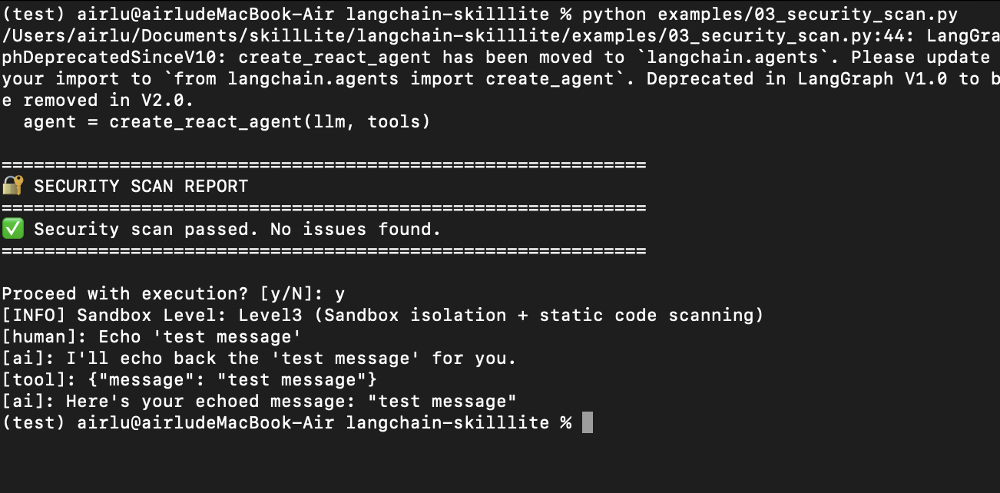
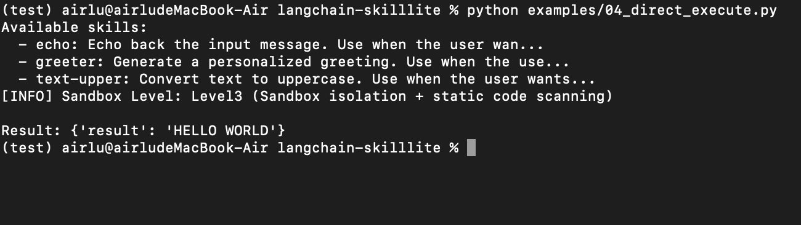

# langchain-skilllite

[](https://badge.fury.io/py/langchain-skilllite)
[](https://opensource.org/licenses/MIT)
[](https://www.python.org/downloads/)

LangChain integration for [SkillLite](https://github.com/EXboys/skilllite) - a lightweight sandboxed Python skill execution engine.

## Table of Contents

- [Features](#features)
- [Installation](#installation)
- [Quick Start](#quick-start)
- [Project Structure](#project-structure)
- [Environment Configuration](#environment-configuration)
- [Examples](#examples)
  - [Example 1: Basic Usage](#example-1-basic-usage)
  - [Example 2: Callback Handler](#example-2-callback-handler)
  - [Example 3: Security Scanning](#example-3-security-scanning)
  - [Example 4: Direct Execution](#example-4-direct-execution)
- [Security Levels](#security-levels)
- [API Reference](#api-reference)
- [Troubleshooting](#troubleshooting)
- [Links](#links)

---

## Features

| Feature | Description |
|---------|-------------|
| 🔒 **Sandboxed Execution** | All skills run in a Rust-based sandbox (skillbox) |
| 📝 **Declarative Skills** | Define skills via SKILL.md, no Python wrappers needed |
| 🔍 **Security Scanning** | Pre-execution code analysis for dangerous operations |
| ✅ **Confirmation Callbacks** | User approval for high-severity security issues |
| ⚡ **Async Support** | Full async support for LangGraph agents |
| 🔗 **LangChain Native** | Seamless integration with LangChain agents and LangGraph |

### Advantages over Standard SkillLite

| Aspect | Standard SkillLite | langchain-skilllite |
|--------|-------------------|---------------------|
| Integration | Manual execution | Native LangChain tools |
| Agent Support | Manual loop implementation | Works with any LangChain agent |
| Async | Basic support | Full async support for LangGraph |
| Monitoring | Custom implementation | Built-in callback handlers |

---

## Installation

```bash
pip install langchain-skilllite
```

This will also install the required dependencies:
- `langchain-core>=0.3.0`
- `skilllite>=0.1.1`

### Optional Dependencies

```bash
# For LangGraph support
pip install langchain-skilllite[langgraph]

# For OpenAI integration
pip install langchain-openai

# For development
pip install langchain-skilllite[dev]
```

---

## Quick Start

```python
from langchain_skilllite import SkillLiteToolkit
from langchain_openai import ChatOpenAI
from langgraph.prebuilt import create_react_agent

# Load all skills from a directory as LangChain tools
tools = SkillLiteToolkit.from_directory("./skills")

# Create a LangGraph agent
agent = create_react_agent(ChatOpenAI(model="gpt-4"), tools)

# Run the agent
result = agent.invoke({
    "messages": [("user", "Convert 'hello world' to uppercase")]
})
```

---

## Project Structure

```
langchain-skilllite/
├── langchain_skilllite/        # Main package
│   ├── __init__.py             # Package exports
│   ├── tools.py                # SkillLiteTool & SkillLiteToolkit
│   ├── callbacks.py            # SkillLiteCallbackHandler
│   └── _version.py             # Version info
├── examples/                   # Example scripts
│   ├── 01_basic.py             # Basic usage example
│   ├── 02_with_callback.py     # Callback handler example
│   ├── 03_security_scan.py     # Security scanning example
│   └── 04_direct_execute.py    # Direct execution example
├── .skills/                    # Sample skills for examples
│   ├── echo/                   # Echo skill
│   ├── greeter/                # Greeter skill
│   └── text-upper/             # Text uppercase skill
├── images/                     # Execution result screenshots
├── tests/                      # Test suite
├── .env                        # Environment configuration
└── pyproject.toml              # Package configuration
```

---

## Environment Configuration

Create a `.env` file in your project root:

```bash
# OpenAI Compatible API Configuration
BASE_URL=https://api.openai.com/v1
API_KEY=your-api-key-here
MODEL=gpt-4o-mini

# Skills Configuration
SKILLS_DIR=./.skills

# Network Configuration (Optional)
ALLOW_NETWORK=True
NETWORK_TIMEOUT=30

# Sandbox Configuration
ENABLE_SANDBOX=true
SKILLBOX_SANDBOX_LEVEL=3

# Security Settings
# SKILLBOX_AUTO_APPROVE=1  # Auto-approve all security warnings
SKILLBOX_AUTO_APPROVE=0    # Require manual confirmation

# Resource Limits
EXECUTION_TIMEOUT=120      # Skill execution timeout (seconds)
MAX_MEMORY_MB=256          # Maximum memory limit (MB)
```

### Supported API Providers

| Provider | BASE_URL |
|----------|----------|
| OpenAI | `https://api.openai.com/v1` |
| DeepSeek | `https://api.deepseek.com/v1` |
| Alibaba DashScope | `https://dashscope.aliyuncs.com/compatible-mode/v1` |
| Azure OpenAI | `https://{resource}.openai.azure.com/openai/deployments/{deployment}` |

---

## Examples

### Example 1: Basic Usage

Load skills and use with a LangChain agent.

```python
"""
Basic usage: Load skills and use with LangChain agent.
"""
import os
from pathlib import Path
from dotenv import load_dotenv

from langchain_openai import ChatOpenAI
from langgraph.prebuilt import create_react_agent

from langchain_skilllite import SkillLiteToolkit

# Load .env (from current working directory)
load_dotenv()

# Setup
skills_dir = Path(".skills")
llm = ChatOpenAI(
    base_url=os.getenv("BASE_URL"),
    api_key=os.getenv("API_KEY"),
    model=os.getenv("MODEL", "gpt-4o-mini"),
)

# Load skills as LangChain tools
tools = SkillLiteToolkit.from_directory(skills_dir)

print(f"Loaded {len(tools)} skills: {[t.name for t in tools]}")

# Create agent and run
agent = create_react_agent(llm, tools)
result = agent.invoke({"messages": [("user", "Convert 'hello world' to uppercase")]})

# Print result
for msg in result["messages"]:
    print(f"[{msg.type}]: {msg.content[:200] if msg.content else ''}")
```

**Run the example:**
```bash
cd langchain-skilllite
python examples/01_basic.py
```

**Execution Result:**



---

### Example 2: Callback Handler

Use callback handlers to track and monitor tool execution.

```python
"""
Using callbacks to track tool execution.
"""
import os
from pathlib import Path
from dotenv import load_dotenv

from langchain_openai import ChatOpenAI
from langgraph.prebuilt import create_react_agent

from langchain_skilllite import SkillLiteToolkit, SkillLiteCallbackHandler

# Load .env (from current working directory)
load_dotenv()

skills_dir = Path(".skills")
llm = ChatOpenAI(
    base_url=os.getenv("BASE_URL"),
    api_key=os.getenv("API_KEY"),
    model=os.getenv("MODEL", "gpt-4o-mini"),
)

tools = SkillLiteToolkit.from_directory(skills_dir)

# Create callback handler
callback = SkillLiteCallbackHandler()

agent = create_react_agent(llm, tools)
result = agent.invoke(
    {"messages": [("user", "Greet Alice")]},
    config={"callbacks": [callback]}
)

# Show execution stats
summary = callback.get_execution_summary()
print(f"\nExecutions: {summary['tool_executions']}")
print(f"Successful: {summary['successful']}")
```

**Run the example:**
```bash
cd langchain-skilllite
python examples/02_with_callback.py
```

**Execution Result:**



---

### Example 3: Security Scanning

Enable security scanning with user confirmation for sandbox level 3.

```python
"""
Using security scanning with confirmation callback (sandbox level 3).
"""
import os
from pathlib import Path
from dotenv import load_dotenv

from langchain_openai import ChatOpenAI
from langgraph.prebuilt import create_react_agent

from langchain_skilllite import SkillLiteToolkit

# Load .env (from current working directory)
load_dotenv()

skills_dir = Path(".skills")
llm = ChatOpenAI(
    base_url=os.getenv("BASE_URL"),
    api_key=os.getenv("API_KEY"),
    model=os.getenv("MODEL", "gpt-4o-mini"),
)


# Define confirmation callback for user approval
def confirm_execution(report: str, scan_id: str) -> bool:
    """Ask user to confirm skill execution after security scan."""
    print("\n" + "=" * 60)
    print("🔐 SECURITY SCAN REPORT")
    print("=" * 60)
    print(report)
    print("=" * 60)
    response = input("\nProceed with execution? [y/N]: ").strip().lower()
    return response == 'y'


# Enable security scanning with confirmation callback
tools = SkillLiteToolkit.from_directory(
    skills_dir,
    sandbox_level=3,  # Enable security scanning
    force_confirmation=True,  # Always ask for confirmation
    confirmation_callback=confirm_execution,
)

agent = create_react_agent(llm, tools)
result = agent.invoke({"messages": [("user", "Echo 'test message'")]})

for msg in result["messages"]:
    print(f"[{msg.type}]: {msg.content[:200] if msg.content else ''}")
```

**Run the example:**
```bash
cd langchain-skilllite
python examples/03_security_scan.py
```

**Execution Result:**



---

### Example 4: Direct Execution

Execute skills directly without an LLM agent.

```python
"""
Direct skill execution without LLM.
"""
from pathlib import Path
from skilllite import SkillManager

skills_dir = Path(".skills")

# Create manager
manager = SkillManager(skills_dir=str(skills_dir))

# List skills
print("Available skills:")
for skill in manager.list_skills():
    print(f"  - {skill.name}: {skill.description[:50]}...")

# Execute directly
result = manager.execute("text-upper", {"text": "hello world"})
print(f"\nResult: {result.output}")
```

**Run the example:**
```bash
cd langchain-skilllite
python examples/04_direct_execute.py
```

**Execution Result:**



---

## Security Levels

SkillLite supports three sandbox security levels:

| Level | Description | Use Case |
|-------|-------------|----------|
| **1** | No sandbox - direct execution | Development & trusted skills |
| **2** | Sandbox isolation only | Standard protection |
| **3** | Sandbox + security scanning (default) | Production & untrusted skills |

### Level 3: Security Scanning

When `sandbox_level=3`, skills are scanned before execution:

```python
def confirm_execution(report: str, scan_id: str) -> bool:
    print(report)
    return input("Proceed? [y/N]: ").lower() == 'y'

tools = SkillLiteToolkit.from_directory(
    "./skills",
    sandbox_level=3,
    confirmation_callback=confirm_execution
)
```

### Async Confirmation (for LangGraph)

```python
import asyncio

async def async_confirm(report: str, scan_id: str) -> bool:
    print(report)
    # In a real app, this might be a UI prompt
    return True

tools = SkillLiteToolkit.from_directory(
    "./skills",
    sandbox_level=3,
    async_confirmation_callback=async_confirm
)
```

---

## API Reference

### SkillLiteTool

LangChain `BaseTool` adapter for a single SkillLite skill.

```python
from langchain_skilllite import SkillLiteTool

tool = SkillLiteTool(
    name="skill_name",
    description="Skill description",
    manager=manager,
    skill_name="skill_name",
    allow_network=False,
    timeout=60,
    sandbox_level=3,
    confirmation_callback=confirm_execution,
)
```

### SkillLiteToolkit

Factory class for creating multiple `SkillLiteTool` instances.

```python
from langchain_skilllite import SkillLiteToolkit

# From a skills directory (recommended)
tools = SkillLiteToolkit.from_directory(
    skills_dir="./skills",
    skill_names=["calculator", "web_search"],  # Optional filter
    allow_network=True,
    timeout=60,
    sandbox_level=3,
    confirmation_callback=confirm_execution,
)

# From an existing SkillManager
from skilllite import SkillManager

manager = SkillManager(skills_dir="./skills")
tools = SkillLiteToolkit.from_manager(manager)
```

**Parameters:**

| Parameter | Type | Default | Description |
|-----------|------|---------|-------------|
| `skills_dir` / `manager` | str / SkillManager | - | Skills directory path or SkillManager instance |
| `skill_names` | List[str] | None | Filter to specific skills (default: all) |
| `allow_network` | bool | False | Allow network access for skills |
| `timeout` | int | None | Execution timeout in seconds |
| `sandbox_level` | int | 3 | Sandbox security level (1/2/3) |
| `force_confirmation` | bool | False | Always require confirmation |
| `confirmation_callback` | Callable | None | Sync confirmation callback |
| `async_confirmation_callback` | Callable | None | Async confirmation callback |

### SkillLiteCallbackHandler

LangChain callback handler for monitoring skill execution.

```python
from langchain_skilllite import SkillLiteCallbackHandler

handler = SkillLiteCallbackHandler(verbose=True)

# Use with agent
result = agent.invoke(
    {"messages": [("user", "Run my skill")]},
    config={"callbacks": [handler]}
)

# Get execution summary
summary = handler.get_execution_summary()
print(f"Total executions: {summary['tool_executions']}")
print(f"Successful: {summary['successful']}")
print(f"Errors: {summary['errors']}")
print(f"Success rate: {summary['success_rate']:.2%}")
```

---

## Troubleshooting

### Common Issues

#### 1. Skills Not Found

```
Error: No skills found in directory
```

**Solution:** Ensure your skills directory contains valid skill folders with `SKILL.md` files.

```bash
.skills/
├── my-skill/
│   ├── SKILL.md      # Required
│   └── scripts/
│       └── main.py   # Entry point
```

#### 2. API Key Not Set

```
Error: OpenAI API key not found
```

**Solution:** Create a `.env` file with your API configuration:

```bash
API_KEY=your-api-key-here
BASE_URL=https://api.openai.com/v1
MODEL=gpt-4o-mini
```

#### 3. Sandbox Binary Not Found

```
Error: skillbox binary not found
```

**Solution:** Install the skilllite package with sandbox support:

```bash
pip install skilllite[sandbox]
```

#### 4. Security Scan Blocking Execution

```
🔐 Security Review Required
```

**Solution:** Either provide a `confirmation_callback` or set `sandbox_level=2`:

```python
# Option 1: Add confirmation callback
tools = SkillLiteToolkit.from_directory(
    "./skills",
    confirmation_callback=lambda r, s: True  # Auto-approve
)

# Option 2: Disable security scanning
tools = SkillLiteToolkit.from_directory(
    "./skills",
    sandbox_level=2
)
```

#### 5. Timeout Errors

```
Error: Skill execution timed out
```

**Solution:** Increase the timeout value:

```python
tools = SkillLiteToolkit.from_directory(
    "./skills",
    timeout=120  # 2 minutes
)
```

### Environment Variables

| Variable | Description | Default |
|----------|-------------|---------|
| `SKILLBOX_SANDBOX_LEVEL` | Default sandbox level | 3 |
| `SKILLBOX_AUTO_APPROVE` | Auto-approve security warnings | 0 |
| `EXECUTION_TIMEOUT` | Default execution timeout | 120 |
| `MAX_MEMORY_MB` | Maximum memory for skill execution | 512 |

---

## Requirements

- Python >= 3.9
- langchain-core >= 0.3.0
- skilllite >= 0.1.1
- python-dotenv (for examples)
- langchain-openai (for LLM integration)
- langgraph (for agent examples)

---

## License

MIT License - see [LICENSE](LICENSE) for details.

---

## Links

- [SkillLite Repository](https://github.com/EXboys/skilllite)
- [langchain-skilllite on PyPI](https://pypi.org/project/langchain-skilllite/)
- [LangChain Documentation](https://python.langchain.com/)
- [LangGraph Documentation](https://langchain-ai.github.io/langgraph/)
- [LangChain Integration Tutorial](../tutorials/04_langchain_integration/README.md)

